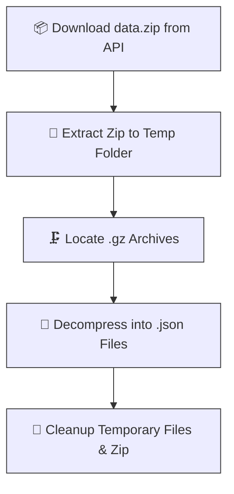

# Amplitude-ELT

Amplitude API Data Extractor 🚀
A Python pipeline to seamlessly extract, decompress, and organize raw event data from the Amplitude Export API (EU endpoint).

Features
Time Chunking: Automatically breaks down the timeframe into manageable daily chunks (from a set start date up to the current hour).

Built-in Retry Logic: Catches those sus 5xx server statuses and safely retries before throwing a PANIK.

Auto-Extraction: Handles the nested Russian-doll situation of ZIP -> GZ -> JSON automatically.

Self-Cleaning: Verifies the extracted files actually contain data, deletes the original .gz files, and wipes the temporary extraction directories once finished.

Solid Logging: Keeps a detailed timestamped .log file in the /logs directory so you know exactly when "Logger has lift off."

Roadmap & Improvements 🛠️

Safer Zip Deletion: Currently, the script deletes the downloaded data.zip file at the end of the run. An upgrade to consider is comparing the gz_file_count against the json_file_count before deleting the zip. If they don't match, the script should hold onto the zip and perhaps trigger a retry for that specific chunk.

Robust Directory Cleanup: The script uses shutil.rmtree() to nuke the intermediate extraction folder. We should add a check to verify that the directory is actually empty (meaning all .gz files were successfully extracted and moved) before deleting it.

Dynamic Start Dates: Instead of hardcoding start_dttime_str, we could pass it in as a command-line argument or check the /data folder to automatically resume extraction from the last pulled date.

Diagram🗺️

