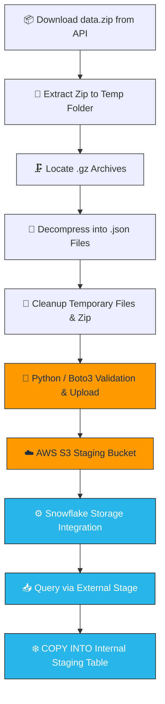
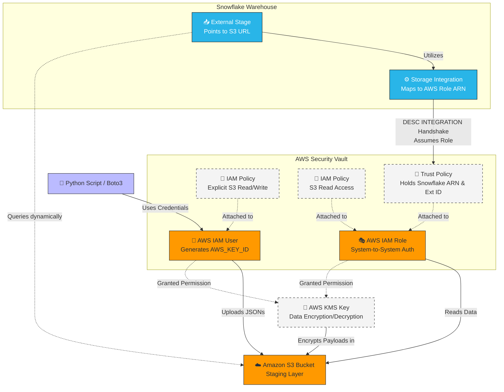
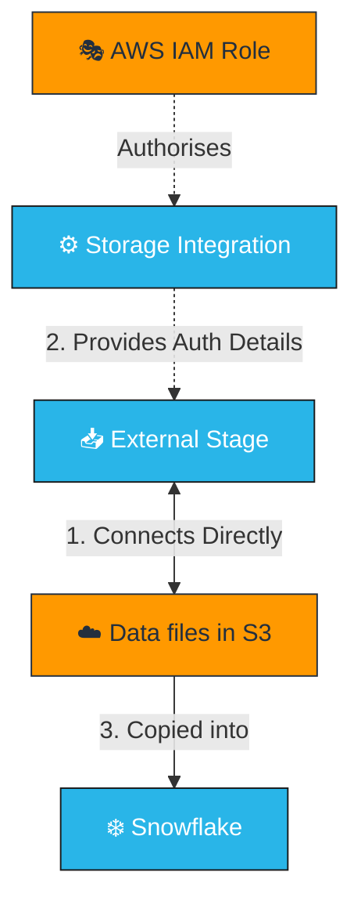

# Amplitude-ELT

**Diagram 🗺️**

**Amplitude API Data Extractor 🚀**
A Python pipeline to seamlessly extract, decompress, and organize raw event data from the Amplitude Export API (EU endpoint).

**Features**

Time Chunking:
Automatically breaks down the timeframe into manageable daily chunks (from a set start date up to the current hour).

Built-in Retry Logic:
Catches 5xx server statuses and safely retries before logging errors.

Auto-Extraction:
Handles the nested Russian-doll situation of ZIP -> GZ -> JSON automatically.

Self-Cleaning:
Verifies the extracted files actually contain data, deletes the original .gz files, and wipes the temporary extraction directories once finished.

Solid Logging:
Keeps a detailed timestamped .log file in the /logs directory so you know exactly when "Logger has lift off."

**Loading Phase: Into the Cloud (AWS & Snowflake) ❄️☁️**

Moving our locally stored JSONs into the cloude(AWS). The pipeline now securely ships data up to an Amazon S3 bucket and copies it straight into Snowflake using automated ELT architecture.

**Features**

S3 Upload Check:
First checks if the JSON exists in AWS before attempting to upload.

Logging:
Logs the status of each file within AWS, noting if the file has been uploaded or is 'Already There'

**Roadmap & Improvements 🛠️**

Safer Zip Deletion: Currently, the script deletes the downloaded data.zip file at the end of the run. An upgrade to consider is comparing the gz_file_count against the json_file_count before deleting the zip. If they don't match, the script should hold onto the zip and perhaps trigger a retry for that specific chunk.

Local json Deletion: Similar to the zip file it would be worth adding a step where once we verify the json exists in S3 it is removed from local storage.

Robust Directory Cleanup: The script uses shutil.rmtree() to nuke the intermediate extraction folder. We should add a check to verify that the directory is actually empty (meaning all .gz files were successfully extracted and moved) before deleting it.

Dynamic Start Dates: Instead of hardcoding start_dttime_str, we could pass it in as a command-line argument or check the /data folder to automatically resume extraction from the last pulled date.

Further Modularisation: Currently extraction function also does the unzipping. I should seperate out the unzipping into it's own function.

Further Extraction+Load Development: Should create logic which checks if a json exists in S3 for every hour between the start and end date. If not the pipeline should download the missing hours and upload to S3.

### **The Architecture & Security Breakdown**

The handshake between AWS and Snowflake for security purposes:

**AWS Infrastructure (The Vault):**

**KMS Encryption:** Built a custom KMS Key to encrypt data landing in our S3 bucket. Both the IAM User (for Python) and the IAM Role (for Snowflake) must be granted permissions to use this key so they can successfully encrypt and decrypt the payloads.

**IAM Policies & Users:** Created a dedicated IAM User. An IAM Policy defining explicit read/write access to the specific S3 bucket is attached directly to this User. Python then uses this User's generated credentials (`AWS_KEY_ID` / `AWS_SECRET_KEY`) via `boto3` to securely load the bucket with files.

**IAM Roles (System-to-System):** Instead of using fragile static keys for Snowflake, we leverage an AWS IAM Role. A separate IAM Policy granting S3 read access is attached to this Role. Roles are significantly more secure for application-level authentication.

**Snowflake Staging (The Warehouse Entrance):**

**Compute (Virtual Warehouse):** Before pulling any data, a Snowflake schema is created(selected) so we have a location for our amplitude data.

**Storage Integration:** Set up a secure Snowflake object (`STORAGE_INTEGRATION`) that maps directly to our AWS IAM Role ARN. This integration object stores the cloud provider configurations.

**The Trust Handshake:** This is where the two platforms actually connect. After creating the Storage Integration, we run a `DESC INTEGRATION` command in Snowflake. This generates two unique values: Snowflake's internal AWS User ARN and a specific External ID. We take these values and paste them into the AWS IAM Role's trust relationship JSON.

**Trust Policy**. By doing this, we explicitly tell AWS: "It is safe to let Snowflake's specific internal user assume this AWS Role."

**External Stage:** Created a Snowflake stage pointing to the S3 bucket URL, utilizing our storage integration to dynamically read the raw JSON payloads.

**Bulk Loading:** Uses `COPY INTO` command using the active virtual warehouse to pull data from the External Stage directly into our internal relational staging tables.

### **Key Loading Considerations 🧠**

- **Schema-on-Read vs. Write:** While S3 treats data with ultimate "Schema-on-Read" flexibility, Snowflake enforces a rigid "Schema-on-Write" structure. We ingest raw JSON fields cleanly into variant/staging tables before applying transformations.

---

### **New Things Learned 🧠**

- **Boto3:**
  Introduced the `boto3` library! This AWS SDK is used to connect to the S3 bucket, in this project it is used to verify if files already exist using `head_object` metadata checks, and upload new JSON files.
- **Safety First (Try/Except):**
  Now properly grasping the purpose of try and excepts oppose to if statements with respect to error handling.
- **Modularizing Code:**
  Broke the pipeline into distinct, single-purpose scripts (e.g., `load_function.py, extract_function.py`). This separation of concerns makes the codebase cleaner, easier to debug, and highly reusable.
- **AWS Infrastructure:**
  Learned to set up KMS Keys for encryption, IAM Users for bucket access, and secure IAM Roles to connect AWS to Snowflake.
- **Snowflake Staging:**
  Learned a `STORAGE_INTEGRATION` and External Stages in Snowflake, followed by `COPY INTO` commands to move raw data into internal staging tables.
